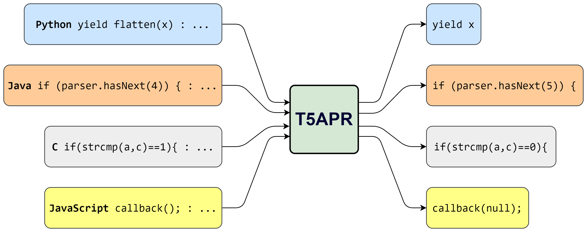

# T5APR: Empowering Automated Program Repair across Languages through Checkpoint Ensemble
[](https://arxiv.org/abs/2309.15742)
[](https://doi.org/10.1016/j.jss.2024.112083)
[](https://huggingface.co/collections/h4iku/t5apr-6514a09a8f20a8ccf7b07f5d)



T5APR is a novel approach to automated program repair (APR) that leverages a multilingual transformer model based on CodeT5 along with a checkpoint ensemble strategy to generate patches for programs written in Python, Java, C, and JavaScript.

## Results Structure

The ‍`results` directory contains generated plausible patches for each benchmark. The `outputs-multi` directories hold patches generated by the multilingual model, while the `outputs-{language}` directories contain patches produced by models trained on a single language.


## How to Use 

### Set Up

1. Install Python 3.9 or higher and clone this repository with its submodules:

    ```bash
    git clone --recurse-submodules https://github.com/h4iku/T5APR.git
    cd T5APR
    ```

2. Create a virtual environment and install the dependencies:

    ```bash
    python -m venv .venv
    source .venv/bin/activate

    python -m pip install -U pip setuptools
    pip install -r requirements.txt
    ```

3. Prepare evaluation benchmarks and tree-sitter language grammars:

    Place the evaluation benchmarks in the `benchmarks` directory. Repositories for [QuixBugs](https://github.com/jkoppel/QuixBugs), [Defects4J](https://github.com/rjust/defects4j/), [Bears](https://github.com/bears-bugs/bears-benchmark), and [BugAID](https://dl.acm.org/doi/abs/10.1145/2950290.2950308) are already there. Defects4J needs further steps to install:

    ```bash
    cd benchmarks/Defects4J
    cpanm --installdeps .
    ./init.sh
    ```
    For further information, follow [Defects4J set up instructions](https://github.com/rjust/defects4j/#setting-up-defects4j).

    For the [Codeflaws](https://codeflaws.github.io/) benchmark, download [codeflaws.tar.gz](http://www.comp.nus.edu.sg/%7Erelease/codeflaws/codeflaws.tar.gz) archive and extract it in the `benchmarks/Codeflaws` directory. For [ManyBugs](https://repairbenchmarks.cs.umass.edu/) benchmark, the necessary files are in `benchmarks/ManyBugs.7z`, which you can directly extract in the `benchmarks` directory, but you can also download the complete [scenario tarballs](https://repairbenchmarks.cs.umass.edu/ManyBugs/scenarios/) and extract them in the `benchmarks/ManyBugs/scenarios` directory.
    
    Submodules for tree-sitter language grammars are in the `tools/tree-sitter-lib/vendor` directory, and the compiled library will be in the `tools/tree-sitter-lib/build`. If you didn't download the submodules, you can follow the [tree-sitter](https://github.com/tree-sitter/py-tree-sitter) instructions to clone the required language grammars into the same directory.

4. To run each module, navigate to the root of the repository and execute the following command:

    ```bash
    python -m package.module
    ```

    For example, to run the `src/bugline_finders/quixbugs_python.py` module:

    ```bash
    python -m src.bugline_finders.quixbugs_python
    ```

    To run tests:

    ```bash
    python -m pytest tests
    ```


### Model Training

Use the `train_model.py` script to fine-tune the pre-trained model. It downloads necessary model and datasets from 🤗 Hugging Face Hub and caches them in the project's `.cache` directory. By default, it uses `codet5-small` as the base model and trains all the languages together in the multitask learning setting. You can fine-tune monolingual models by changing the `model_type: ModelType = ModelType.MULTI` variable.

After fine-tuning, you will have five checkpoints in the `models/codet5-small-t5apr-{multi|java|python|c|javascript}` directory based on the `model_type` you chose. The fine-tuned checkpoints used in the paper's experiments are uploaded on the [🤗 Hub](https://huggingface.co/collections/h4iku/t5apr-6514a09a8f20a8ccf7b07f5d), and you can use `download_checkpoints.py` or `extract_checkpoints.py` scripts to get them. `download_checkpoints.py` is faster and uses the [`huggingface_hub`](https://github.com/huggingface/huggingface_hub) client to directly download checkpoints from 🤗 Hub and doesn't need Git LFS installed. `extract_checkpoints.py` needs GIT LFS to work (`git lfs install`). It first clones the model repository and then incrementally extracts checkpoints from its commits. In both scripts, you can change the downloading checkpoints by changing the `repo_name` variable. The default is the multilingual model `codet5-small-t5apr-multi`.

The training data is also on the [🤗 Hub](https://huggingface.co/collections/h4iku/t5apr-6514a09a8f20a8ccf7b07f5d), and there are both raw and preprocessed versions. If you want to locally preprocess the data obtained from [CoCoNuT repository](https://github.com/lin-tan/CoCoNut-Artifact/releases/tag/training_data_1.0.0), you can download and follow [their instructions](https://github.com/lin-tan/CoCoNut-Artifact/releases/download/training_data_1.0.0/readme.md) to put them in the `data` directory (The uncompressing process will take some time!) and use `preprocess.py` to preprocess it. The preprocessed data will be in the same directory.


### Finding Bug Lines & Patch Generation

Scripts in the `bugline_finders` directory are used to extract buggy lines and other metadata from bugs in the evaluation benchmark programs by comparing buggy and correct diffs. The outputs will be saved in the `generated_assets` folder under the name of each benchmark.

To generate primary candidate patches for the previously extracted buggy lines use `generate_primary_candidates.py`. You can change the `dataset` value to generate candidate patches for different benchmarks. The Boolean variable `multi` decides if you want to generate candidate patches using the multilingual checkpoints or the language-specific monolingual ones. The output will be saved in a file named `sequences_{beam_size}.jsonl` in the `outputs-multi` or `outputs-{language}` directory depending on the model you choose.

The `sequences_{beam_size}.jsonl` file has the candidate patches generated from all the checkpoints. You can then use `combine_checkpoints_results.py` to combine checkpoint patches into a single list of candidate patches resulting in the file `final_candidates_{beam_size}.jsonl`.


### Patch Validation

To validate candidate patches for each benchmark, use scripts in the `validators` folder. Change the `output_dir` variable to choose if you want validation to run on candidate patches from the multilingual or monolingual checkpoints. Validation result of each bug is saved in the `save-state` folder under the bugid filename. Execution of these modules are all resumable, and if they get interrupted in the middle of execution, they will continue validating the remaining bugs next time they run. Final aggregate results of plausible patches are saved in `plausible_candidates_{beam_size}.jsonl` file.

At this point after validation, you can use `separate_d4j_versions.py` script to generate separate folders for bugs in the v1.2 and v2.0 of Defects4J benchmark.

You can rerank patches in final results using the `rerank_patches.py` script where it gives you `reranked_candidates_{beam_size}.jsonl` that you can then use `generate_results.py` to generate plausible results in the `results` directory and start the manual patch assessment process. In the assessment process make sure to change the variable `assessment` to `True`, so it generates results from reranked file. With every change you make to the items in the `results` folder, you can rerun `rerank_patches.py` script to write the assessments back to the `reranked_candidates_{beam_size}.jsonl` file. The `validated_reranked_candidates_100.jsonl` is a copy of `reranked_candidates_100.jsonl` that is updated with our patch assessments and is the file we generated the `results` directory from.


### Misc

The location of the directories and paths where files are written or read from are in `configs.py`.

The complete content of the `generated_assets` directory for all the benchmarks is available [here](https://mega.nz/file/VE8xgbCL#7A0755iOptQonLbQYwnJ2Tw83XBsHq0UiFiJfT-_EcE).


### Evaluation
*TBA*


## Citation

If you use T5APR in your research, please cite the following paper:

```bibtex
@article{gharibiT5APREmpoweringAutomated2023,
  title = {T5APR: Empowering Automated Program Repair across Languages through Checkpoint Ensemble},
  shorttitle = {T5APR},
  author = {Gharibi, Reza and Sadreddini, Mohammad Hadi and Fakhrahmad, Seyed Mostafa},
  year = {2024},
  journal = {Journal of Systems and Software},
  volume = {214},
  pages = {112083},
  doi = {10.1016/j.jss.2024.112083},
}
```